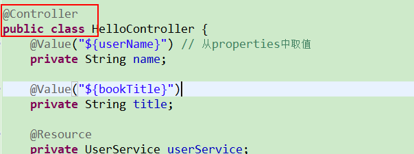

# springboot-thymeleaf
这里记录一下，这个小程序从生到死的过程：

1、在网上偶尔见到这个网址：http://start.spring.io/  感觉还挺方便，在界面上填一填自己的项目名字，勾选下边的web，mybatis,（上边的其余各个选项具体是什么意思，怎么用，我并没有研究）直接点击creat,然后一个压缩包就下载下来了，是一个mvn的web项目。

2、导入到eclipse中（没有使用idea），这样一个基础的springboot的环境就搭建成功了（第1步中自动搭建好的，哈哈），接下来干啥了，有点忘记了，，，，，（这个文档后来补的）
3、自动生成一个springboot的一个启动类，然后自己建一个com.lz.controller包中的HelloController类，刚开始在HelloController类中上注解@RestController,
