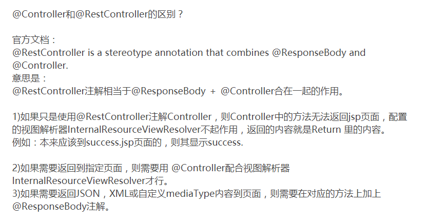
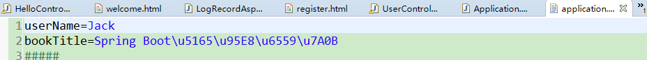
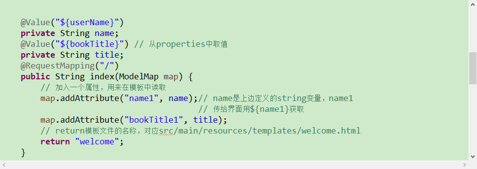
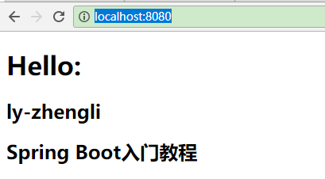

# springboot-thymeleaf
这里记录一下，这个小程序从生到死的过程(只是把springboot当成一个黑盒子来用，好多地方都没有追究为啥这样（还需自己多努力研究），仅仅 拿来使用)：

主要依赖于mvn，所以前提是在编译器上装mvn

### 第一部分

1、在网上偶尔见到这个网址：http://start.spring.io/  感觉还挺方便，在界面上填一填自己的项目名字，勾选下边的web，mybatis,（上边的其余各个选项具体是什么意思，怎么用，我并没有研究）直接点击creat,然后一个压缩包就下载下来了，是一个mvn的web项目。

2、导入到eclipse中（没有使用idea），这样一个基础的springboot的环境就搭建成功了（第1步中自动搭建好的，哈哈），接下来干啥了，有点忘记了，，，，，（这个文档后来补的）

3、自动生成一个springboot的一个启动类，然后自己建一个com.lz.controller包中的HelloController类，刚开始在HelloController类中上注解@RestController,
；上图不说话,简单自己的理解就是如果只使用@RestController的话，controller中返回发是json数据，而不会返回的页面上，想要返回的页面就使用@Controller ,或者@RestController和@ResponseBody的组合；

4然后自己在controller中写方法，加@RequestMapping("/hello")，在浏览器上就能直接访问了，别的配置文件自己也不用写，pom文件初始已经加载的有需要的jar包；

### 第二部分 

只是返回josn是不是不好玩，没有界面搞毛线啊，接下来继续回忆怎么开发springboot的web界面
1、不了解springboot的是不是首先想到buid一个.jsp？当你建好之后是不是发现哎呦怎么没有webapp根目录啊，我jsp页面往哪放呢，放到现在的src/main/resources/static目录下？因为这个resource不是根目录吗，放进去试试吧，一试卧槽，浏览器已访问怎么不是 我想想的样子，反而是直接把jsp下载下来了，至于为啥下载下来，没有去研究，继续一了解看到springboot不推荐使用jsp，（如果想用也是能使用的，但是需要配置），就使用了thymeleaf模板引擎，什么渲染的，也不懂，就不多说了，拿来用就行，想要使用别的东西，首先肯定是在pom中加入依赖啊
    <dependency>
            <groupId>org.springframework.boot</groupId>
            <artifactId>spring-boot-starter-thymeleaf</artifactId>
    </dependency>；
2、 springboot有一个默认的目录用于存放thymeleaf这个的页面文件，就是src/main/resources/templates，当然也可以自己定义目录，但是需要在properties中
自己定义配置路径。

3、在src/main/resources/有一个默认的配置文件application.properties，（有人喜欢这个application.yml，看自己爱好），首先在properties配置一个简单变量
,配置好变量，怎么能在浏览器上查看呢，在controller中定义变量并注解形式@Value("${userName}")读取变量值，,然后在第二步说的路径下建welcome.html，再在浏览器上访问，因为controller中的方法注解中什么路径都没写，所以这里直接http://localhost:8080/  ；然后就看到这个鸟样子了;有没有发现之前properties中userName配的是Jack，这里怎么显示的不是呢，或者把配置文件中的这个变量注释掉，界面上为什么还是ly-zhengli，貌似controller中 @Value("${userName}")这样使用【userName】这个鬼东西默认取到电脑的名字，

### 第三部分

这样就说明，springboot的静态资源已经可以建单使用，那么就需要来玩玩动态数据了，添加数据库，这里使用Mybatis这个框架。Mysql数据库

1、同样的路数，pom中添加 引用：
        <!-- Spring-Mybatis -->
        <dependency>
            <groupId>org.mybatis.spring.boot</groupId>
            <artifactId>mybatis-spring-boot-starter</artifactId>
            <version>1.3.0</version>
        </dependency>

        <!-- MySQL -->
        <dependency>
            <groupId>mysql</groupId>
            <artifactId>mysql-connector-java</artifactId>
        </dependency>
2、然后建库建表，建两个非常简单的表user和log，user只有id、name、age（弄表的时候没有弄密码，后来写老套路的系统登录注册的时候，发现没有密码，就把age当密码来用，哈哈，不走常规路），log是为了用aop切点写日志（每个系统肯定都少不了日志的），也是只有id、logdate、content；简单应付了事，说明一下问题就行。象征性的提供一下脚本<a href="spring.sql">

